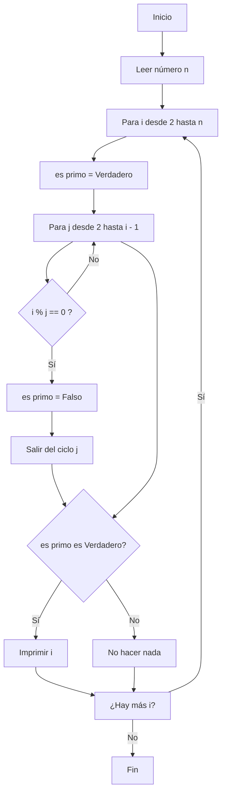

# Numeros-Primos..

### - Que voy a hacer 
En este reto (número 3), voy a hacer un pseudocódigo y un diagrama de flujo en el cual se indentifiquen todos los números primos que sean menores a un número natural N.


## Pseudocódigo 

```
Inicio
    Escribir "Ingresa un número:"
    Leer n

    Para i desde 2 hasta n hacer

        esPrimo ← Verdadero

        Para j desde 2 hasta i - 1 hacer
            Si i mod j = 0 entonces
                esPrimo ← Falso
                Salir del Para
            Fin Si
        Fin Para

        Si esPrimo entonces
            Escribir i
        Fin Si

    Fin Para
Fin
```

## Diagrama de Flujo



## Muchas Gracias X La Atencion Prestada 


